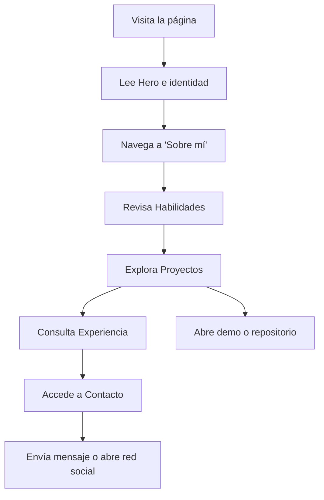

# PRD — Portafolio para Programadores

## 1. Visión General del Producto
Portafolio web personal, sobrio y moderno, orientado a programadores que desean mostrar su perfil profesional, proyectos y habilidades técnicas con una identidad visual minimalista y elegante.
- **Propósito**: Presentar de forma clara y memorable la identidad, experiencia, stack técnico y proyectos del programador.
- **Usuarios objetivo**: Reclutadores técnicos, clientes potenciales, colegas y la comunidad de desarrollo.
- **Valor**: Combina una estética editorial refinada con información técnica precisa, transmitiendo profesionalismo y atención al detalle.

## 2. Funcionalidades Principales

### 2.1 Roles de Usuario
No requiere autenticación. Es un sitio público de presentación.

### 2.2 Módulos Funcionales
1. **Página única (single-page)**: navegación fija + secciones ancladas.
2. **Sección Hero**: identidad, rol y llamada a la acción.
3. **Sección Sobre mí**: biografía breve y filosofía de trabajo.
4. **Sección Habilidades**: stack técnico organizado por categorías.
5. **Sección Proyectos**: galería de proyectos con descripción, tecnologías y enlaces.
6. **Sección Experiencia**: línea de tiempo profesional.
7. **Sección Contacto**: enlaces a redes profesionales y formulario simple.
8. **Tema claro/oscuro**: alternador de tema con persistencia en `localStorage`.

### 2.3 Detalles de Página
| Sección | Módulo | Descripción de la Funcionalidad |
|---------|--------|----------------------------------|
| Hero | Presentación | Nombre, título profesional, frase de impacto y CTAs (Ver proyectos, Contacto) |
| Hero | Indicador de scroll | Animación sutil que invita a deslizar |
| Sobre mí | Biografía | Párrafo con tipografía editorial, valores y enfoque |
| Habilidades | Stack | Chips/badges agrupados por categoría (Lenguajes, Frameworks, Herramientas, Cloud) |
| Proyectos | Galería | Cards asimétricas con thumbnail, título, descripción corta, stack usado, enlaces a demo y código |
| Experiencia | Timeline | Lista cronológica de cargos con empresa, fechas y descripción |
| Contacto | Enlaces | GitHub, LinkedIn, email, CV descargable |
| Contacto | Formulario | Formulario simple (nombre, email, mensaje) con validación en cliente |
| Global | Navegación | Barra superior translúcida con efecto blur, activa según scroll |
| Global | Tema | Toggle dark/light con animación de transición |

## 3. Flujo Principal
El visitante llega al Hero, lee la identidad, navega por las anclas, explora los proyectos (con enlaces externos a demo/código) y utiliza los canales de contacto (formulario o redes).

## 4. Diseño de Interfaz

### 4.1 Estilo de Diseño
- **Paleta (modo oscuro)**: fondo `#0a0a0b`, superficie `#131316`, texto principal `#e6e6e9`, texto secundario `#8a8a93`, acento `#d4ff3a` (verde lima apagado).
- **Paleta (modo claro)**: fondo `#f5f5f0`, superficie `#ffffff`, texto principal `#1a1a1d`, texto secundario `#6a6a72`, acento `#3d8a00`.
- **Tipografía display**: `JetBrains Mono` (encabezados, etiquetas técnicas).
- **Tipografía cuerpo**: `Fraunces` o `Newsreader` (texto editorial,给人一种revista moderna感觉) — alternativa: `IBM Plex Sans` para un look más técnico.
- **Tamaños**: H1 `clamp(3rem, 8vw, 6rem)`, H2 `clamp(2rem, 4vw, 3rem)`, body `1.0625rem` con `line-height: 1.6`.
- **Botones**: estilo rectangular con borde fino, sin sombras pesadas; hover con inversión de color.
- **Layout**: asimétrico, con grid de 12 columnas y elementos que rompen la cuadrícula; uso generoso de espacio negativo.
- **Iconos**: lineal estilo Lucide (SVG inline).
- **Efectos**: cursor personalizado sutil, ruido (grain) superpuesto con baja opacidad, animaciones de entrada staggered al hacer scroll.

### 4.2 Resumen del Diseño por Sección
| Sección | Módulo | Elementos UI |
|---------|--------|--------------|
| Hero | Identidad | Display gigante del nombre, etiqueta con disponibilidad, dos CTAs, indicador de scroll animado |
| Sobre mí | Biografía | Dos columnas: texto principal + datos clave (años de experiencia, proyectos, enfoque) |
| Habilidades | Stack | Lista categorizada con bullets personalizados, animación al entrar en viewport |
| Proyectos | Galería | Grid asimétrico de cards, hover con elevación sutil y cambio de color de borde |
| Experiencia | Timeline | Lista vertical con fechas en monoespaciada y descripciones concisas |
| Contacto | Formulario | Inputs con label flotante, validación visual, botón con estado de envío |
| Global | Navegación | Fija superior, fondo translúcido, blur, indicador de sección activa |
| Global | Toggle tema | Botón circular con icono sol/luna, transición de color en el root |

### 4.3 Responsividad
- Enfoque **desktop-first**, con breakpoints en 1024px (tablet) y 640px (móvil).
- Navegación colapsa a menú hamburguesa en móvil.
- Grid de proyectos pasa de 3 columnas → 2 → 1.
- Tipografías escaladas con `clamp()` para mantener jerarquía.

### 4.4 Efectos Visuales y Atmosféricos
- Textura de grano sutil (`background-image` con SVG noise) sobre todo el sitio.
- Cursor personalizado con un círculo que sigue al punteador con leve retardo.
- Animaciones de reveal al hacer scroll usando `IntersectionObserver`.
- Barra de progreso de lectura en la parte superior.
