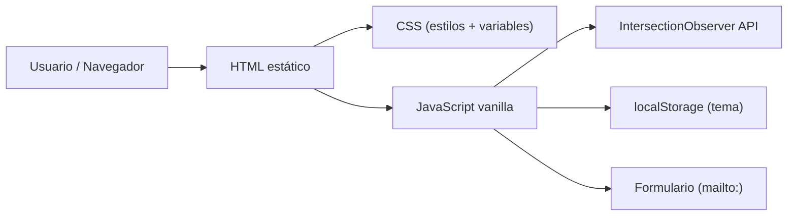

# Arquitectura Técnica — Portafolio para Programadores

## 1. Diseño de Arquitectura
El proyecto es un sitio estático de una sola página (SPA vanilla) sin backend. Se sirve como archivos estáticos desde cualquier servidor web o servicio de hosting estático (GitHub Pages, Netlify, Vercel, etc.).



## 2. Stack Tecnológico
- **Frontend**: HTML5 + CSS3 (variables, Grid, Flexbox, animaciones) + JavaScript ES2020 vanilla.
- **Sin frameworks**: el usuario solicitó explícitamente `html-css-javascript`, por lo que no se usará React/Vue/Angular.
- **Sin backend**: el formulario usa `mailto:` o un servicio externo (Formspree) opcional.
- **Sin base de datos**: toda la información del portafolio está embebida en el HTML o en un objeto JS.

## 3. Estructura de Archivos
```
/
├── index.html              # Página principal
├── css/
│   ├── reset.css           # Reset/normalize
│   ├── variables.css       # Variables CSS (colores, tipografía, espaciado)
│   ├── base.css            # Estilos base y tipografía
│   ├── layout.css          # Layout (header, secciones, footer)
│   ├── components.css      # Componentes (cards, botones, formulario)
│   └── animations.css      # Animaciones y keyframes
├── js/
│   ├── main.js             # Entry point, orquestación
│   ├── theme.js            # Toggle dark/light
│   ├── navigation.js       # Scroll spy y smooth scroll
│   ├── reveal.js           # Animaciones de reveal con IntersectionObserver
│   ├── projects.js         # Render dinámico de proyectos desde data
│   └── data.js             # Información del portafolio (perfil, proyectos, experiencia)
├── assets/
│   ├── images/             # Imágenes de proyectos
│   └── icons/              # SVG inline
├── README.md
└── .trae/documents/        # Documentación
```

## 4. Definición de Tipos / Datos (data.js)
```js
const profile = {
  name: "Axel Pincheira",
  role: "Backend Developer",
  tagline: "...",
  availability: "Disponible para nuevos proyectos",
  email: "...",
  social: { github, linkedin, twitter }
};

const skills = [
  { category: "Lenguajes", items: ["Python", "TypeScript", "Go"] },
  { category: "Frameworks", items: ["FastAPI", "Node.js", "React"] },
  { category: "Herramientas", items: ["Docker", "PostgreSQL", "Git"] },
  { category: "Cloud", items: ["AWS", "GCP", "Vercel"] }
];

const projects = [
  { id, title, description, stack, demoUrl, repoUrl, image }
];

const experience = [
  { company, role, period, description }
];
```

## 5. Convenciones
- **Variables CSS**: definidas en `:root` y `[data-theme="light"]` para alternar temas.
- **Mobile-first**: el CSS base apunta a móvil; las media queries expanden a desktop.
- **JS modular**: cada archivo expone funciones/globales; `main.js` los inicializa con `DOMContentLoaded`.
- **Accesibilidad**: roles ARIA, contraste mínimo AA, foco visible, soporte de `prefers-reduced-motion`.
- **Imágenes**: usar placeholders del servicio `coresg-normal.trae.ai` cuando no se proporcionen imágenes reales.

## 6. Despliegue
- Estático: subir a GitHub Pages / Netlify / Vercel sin build step.
- No requiere variables de entorno.
